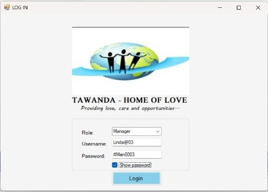
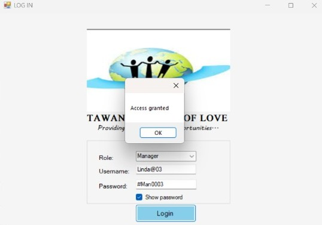
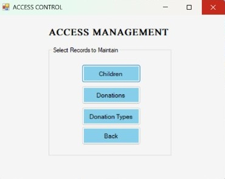
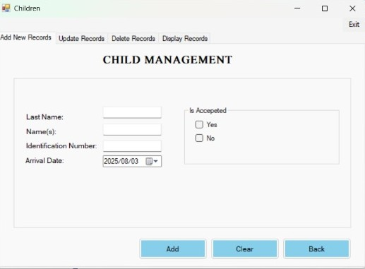
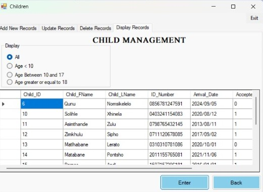

# 🏡 Orphanage Management System — A Heartfelt Digital Solution
Welcome to the official repository for the Tawanda Orphanage Management System, a simple system designed to bring structure, care and clarity to the management of orphanage operations. Whether you're tracking children’s records, managing donations or coordinating staff activities — this system is your digital companion in compassion.
## Overview
This system was born out of a desire to simplify and modernize the way orphanages manage their internal data. Inspired by real-world challenges and built with empathy, the development process mostly focused on delivering a low cost but efficient system. It offers:
##### - Child Record Management — Track personal details, health info and educational progress.
##### - Donation Tracking — Log donor details, donation amounts and generate reports.
##### - Staff Coordination — Assign roles and manage access control to different parts of the system.
##### - Report Generation — Users can generate reports from the data in the system according to their desired requirements.

## Preview

| Log In Form | Message | Access Control | Children Records Management | Records |
|-------------|------------------|--------------|-----------|-----------|
|  |  ||  |   |

## Tech Stack
|Layer|Technology Used|
|---------|----------|
|Front/BackEnd| C# |
|Database|MySQL|
|Quering Language|SQL|
|Version Control| GitHub|

## Documentation
All technical and functional specifications are available in the GROUP19_FinalDemo_Documentation.docx file. It includes:
- System architecture
- Use Case Models
- Functional requirements
- Installation Guide
- Passwords to access the system

## Contributors
This project was lovingly crafted by Group 19 in their second year of studies — a team of passionate NWU students committed to making a difference through code.

1. Makanaka Farasi
2. Neo Hlumbene
3. Amogelang Montjane
4. Michel Sibanda
5. Solihle Xhinela

## 💌 Feedback & Support
Have ideas to improve the system? Want to contribute? Open an issue or drop us a message — we’d love to hear from you! Additionally you can email: solihlexhinela8@gmail.com OR neohlumbene@gmail.com
